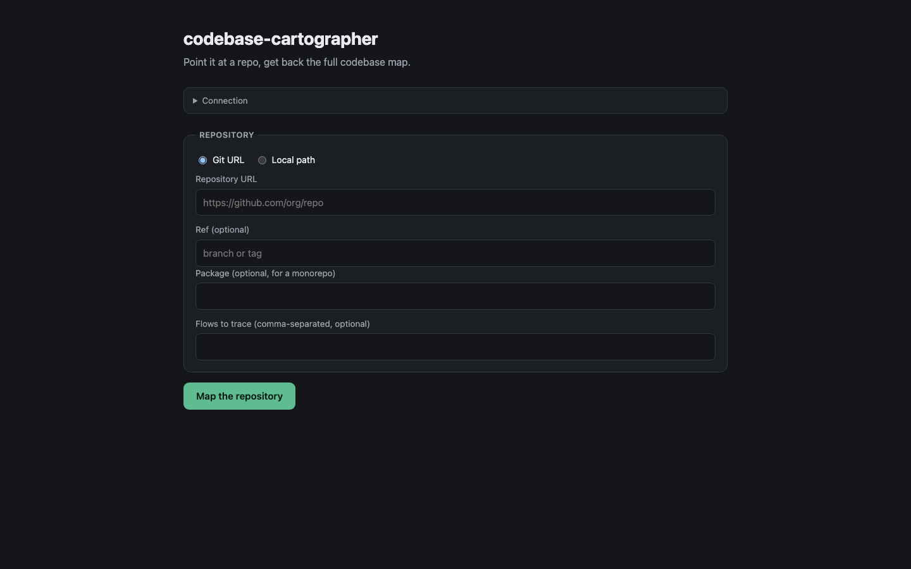

# Codebase Cartography

Skills that crawl an unfamiliar codebase and map it for a new engineer. Point them at a repo and they generate the docs you actually need to understand a system fast: architecture, dependencies, the API surface in both directions, request and data flows, the data model, the tech stack, the config surface, mermaid diagrams, and a getting-started guide. Everything lands as markdown in `docs/codebase-map/` inside the target repo.

Built for the common problem of landing in a large codebase, or several at once, with no map. The base layer is a disciplined crawl method: read the manifests, find the entry points, follow the import graph, and sample instead of reading everything. The focused skills sit on top and each write one doc.

## Install

As a Claude Code plugin, add this repo as a marketplace and install `codebase-cartography`. Or use the `npx skills` installer:

```bash
npx skills@latest add pronoy1004/codebase-cartography
```

The generated docs read best with the [writing-skills](https://github.com/pronoy1004/writing-skills) plugin installed, which supplies the `writing-style` and `write-tech-doc` prose layers these skills apply. It is optional. Without it the skills fall back to plain, human prose.

### Any other agent

These are plain [Agent Skills](https://agentskills.io), so they work in any compatible client (Cursor, GitHub Copilot, Codex, Gemini CLI, OpenCode, Goose, and the rest). Copy the skills into the `.agents/skills/` directory that clients scan:

```bash
git clone https://github.com/pronoy1004/codebase-cartography && cp -r codebase-cartography/skills/* ~/.agents/skills/
```

Use `~/.agents/skills/` to make them available everywhere, or `<project>/.agents/skills/` to scope them to one repo.

## Use

Point the entry-point skill at a repo:

> map this codebase

It runs the whole pipeline and pauses between steps. Or invoke a single skill on its own, for example "map the architecture" or "trace the main request flow".

## Agent service

The skills above pause between phases so you can skip one. If you want the same pipeline
callable from your own UI, a script, or CI, this repo also ships an agent service in
[agents/codebase-cartographer](agents/codebase-cartographer). It runs every phase without
pausing and returns the generated docs in the response.

The service runs on whatever LLM provider you already have a key for (Anthropic, OpenAI,
Gemini, or anything else [litellm](https://docs.litellm.ai/) supports) via
[agent-runtime](https://github.com/pronoy1004/agent-runtime). Gemini has a genuinely free
API tier, so it's the fastest way to try the service without a paid key:
[aistudio.google.com](https://aistudio.google.com/apikey).

```bash
pip install "agent-runtime @ git+https://github.com/pronoy1004/agent-runtime" uvicorn
export AGENT_API_KEY="$(python3 -c 'import secrets; print(secrets.token_urlsafe(32))')"
export GEMINI_API_KEY=...  # or ANTHROPIC_API_KEY / OPENAI_API_KEY, matched to AGENT_MODEL
cd agents/codebase-cartographer && uvicorn main:app --port 8002
```

### UI

Open `http://localhost:8002/` for a small built-in page: point it at a git URL or local
path, watch the exploration tool calls stream in, then browse the generated docs by
filename and download the whole map as a tarball.



### API

Point it at a git URL, or at a local path if you allow one:

```bash
curl -X POST localhost:8002/runs -H "X-API-Key: $AGENT_API_KEY" \
  -H 'content-type: application/json' \
  -d '{"repo":{"type":"git","url":"https://github.com/owner/repo","ref":"main"}}'
```

`GET /runs/{id}/events` streams progress, `GET /runs/{id}` returns every generated doc as
text, and `GET /runs/{id}/artifact` returns them as a tarball. Runs take minutes, so nothing
blocks.

There's no plugin/skill-loading mechanism outside Claude Code, and no
Read/Grep/Glob/Bash/Write tool set to reuse. The service reads each skill's `SKILL.md` and
folds it into the system prompt instead of loading it as a live plugin, and it hands the
model four hand-written functions in `agents/codebase-cartographer/tools.py`: `glob_files`,
`read_file`, `grep`, `write_doc`. There is no Bash equivalent. The skill files themselves
are not modified.

### Sandboxing

The service still clones a repository you gave it, which is worth containing even without
a shell in the loop.

Dropping Bash removes the main risk a container would otherwise guard against: the model
has no way to run a command, so there is nothing to sandbox at the process level the way a
Claude-Code-based agent would need. What is left is `tools.py`'s own path checks:
`read_file`, `grep`, and `write_doc` all resolve the caller's path and refuse anything that
lands outside the checkout, including a symlink planted inside it that points out; `write_doc`
additionally refuses any destination outside `docs/codebase-map/`. Those checks have their
own test file (`test_tools.py`) precisely because they are now the whole boundary.

The container is still worth running. The included Dockerfile runs as a non-root user, and
containing the git clone step and the process as a whole costs nothing and catches whatever
a future change to `tools.py` might get wrong. Give it no host mounts, and limit egress to
the git host you clone from.

Local paths are refused unless `ALLOWED_REPO_ROOTS` names the directories the service may
read. Left unset, only git URLs work, which is the right default in a container. Setting it
to `/` hands the agent your whole filesystem.

The agent also treats everything in the mapped repository as untrusted data. If a file
contains text addressed to the agent, it does not act on it; it quotes it back in
`injection_notices` on the result. Set `AGENT_MODEL` to a `provider/model` string (e.g.
`anthropic/claude-sonnet-5`) to use something other than the Gemini default.

The HTTP surface, streaming, and auth come from
[agent-runtime](https://github.com/pronoy1004/agent-runtime). The skills are not modified:
the service loads this repo as a plugin exactly as it sits.

## Skills

### The engine

- **[explore-codebase](skills/explore-codebase/SKILL.md)** the base crawl method every other skill builds on. Read manifests first, find entry points, follow the graph, sample representative files, use Explore subagents for breadth. Includes a per-language manifest and entry-point cheatsheet.
- **[map-codebase](skills/map-codebase/SKILL.md)** the entry point. Runs the full pipeline in order and assembles the `docs/codebase-map/` index that ties every doc together.

### The maps

- **[map-architecture](skills/map-architecture/SKILL.md)** components, layers, boundaries, and how the parts communicate. The design, not the folder tree.
- **[inventory-tech-stack](skills/inventory-tech-stack/SKILL.md)** languages, frameworks, runtimes, package managers, build and test tooling, and CI/CD.
- **[map-dependencies](skills/map-dependencies/SKILL.md)** external packages with the reason for each, plus the internal module graph, coupling hot spots, and cycles.
- **[map-apis](skills/map-apis/SKILL.md)** the API surface both ways: endpoints and interfaces created, and the services, SDKs, and stores called.
- **[map-data-model](skills/map-data-model/SKILL.md)** entities, schemas, relationships, migrations, and where each entity is read and written, with an ER diagram.
- **[trace-flows](skills/trace-flows/SKILL.md)** the key flows traced end to end, entry to response, anchored to `path:line` at every hop.
- **[map-config-and-env](skills/map-config-and-env/SKILL.md)** the config surface: env vars, config files, feature flags, and secrets handling. Names only, never values.

### The visuals and the on-ramp

- **[draw-diagrams](skills/draw-diagrams/SKILL.md)** turns the maps and flows into mermaid: component, sequence, dependency, and ER diagrams that render in markdown.
- **[write-onboarding-guide](skills/write-onboarding-guide/SKILL.md)** the getting-started guide: what it does, how to run and test it, the five files to read first, and a glossary.

## Output

Every skill writes into `docs/codebase-map/` in the target repo:

```
docs/codebase-map/
  README.md          index, with the commit sha and date
  onboarding.md      start here
  architecture.md
  tech-stack.md
  dependencies.md
  apis.md
  data-model.md
  flows.md
  config-and-env.md
  diagrams.md
```

The skills read and document only. They never run the code, and they never print a secret value, only its name.

## Spec conformance

Every skill here follows the [Agent Skills specification](https://agentskills.io/specification): a `SKILL.md` per directory with `name` and `description` frontmatter, reference material split into `references/` and loaded only when the instructions call for it, and test cases in `evals/evals.json`.

Check the whole repo against the spec:

```bash
python3 validate.py
```

It validates the name rules and directory match, the 1024-character description limit, the 500-line body limit, `metadata` typing, relative links that resolve, reference links that state when to load them, and the eval file schema.

## Why

A new codebase is expensive to enter. The knowledge is in the code, but it takes days to assemble the map that a senior engineer carries in their head. These skills build that map on demand, keep it in the repo next to the code, and stamp it with the commit it was built from, so it can be refreshed instead of going stale in someone's memory.
