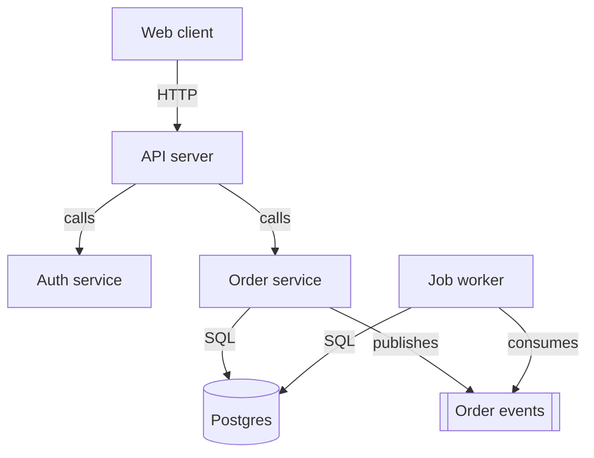
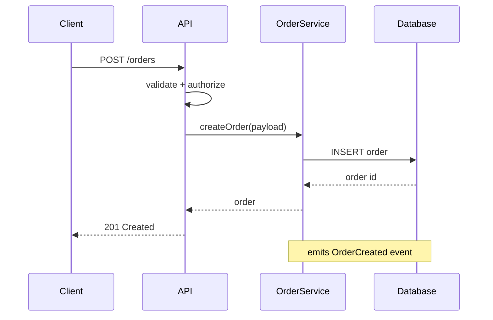
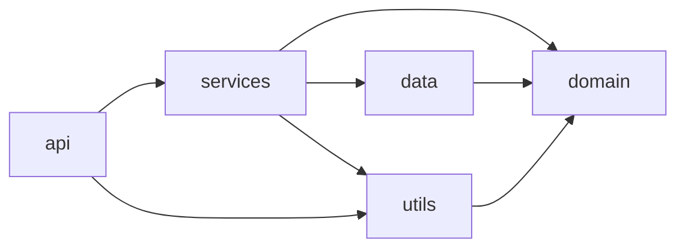
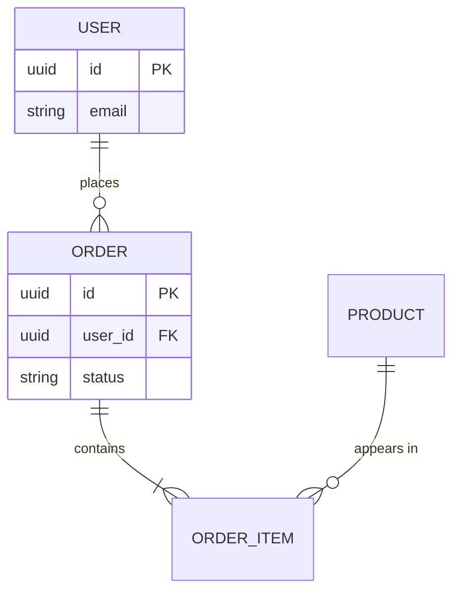
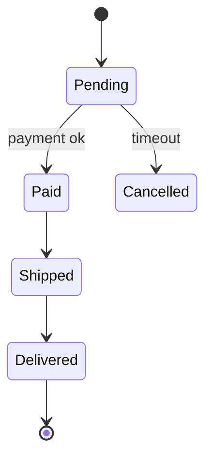

# Mermaid recipes

Copy the template, then fill it with what the maps and flows found. Every block must parse. Keep each diagram under about 15 nodes.

## Component / architecture diagram

From `architecture.md`. Use `flowchart TD` for layers, `LR` for pipelines. Label every edge with the mechanism.

Node shapes: `[box]` service or module, `[(cylinder)]` database, `[[subroutine]]` queue or topic, `{diamond}` decision, `((circle))` external actor.

## Sequence diagram

From each flow in `flows.md`. One participant per component the flow touches. Order the messages as the flow runs.

Use `->>` for a call, `-->>` for a return, `Note over` for a side effect.

## Module dependency graph

From `dependencies.md`. Nodes are modules, edges are "imports". Mark a cycle or a hot spot in the caption.

## Entity relationship diagram

From `data-model.md`. One entity per table or model. Use crow's-foot cardinality.

Cardinality: `||` one, `o{` zero or many, `|{` one or many.

## State diagram

Only if the system has an explicit state machine (an order status, a job lifecycle).

